# Tampilan Ecommerce Warung Ronde 168

Untuk UTS pemgrograman dasar, saya membuat sebuah layout website ecommerce menggunakan framework `Bootstrap` dengan 6 halaman

# Tampilan Home/Awal
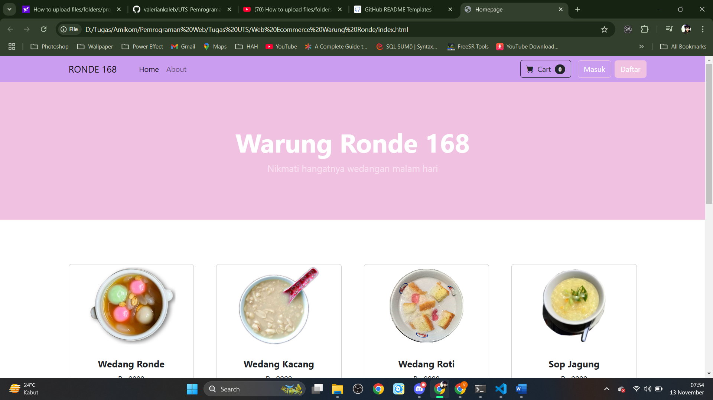

# Tampilan Detail Makanan
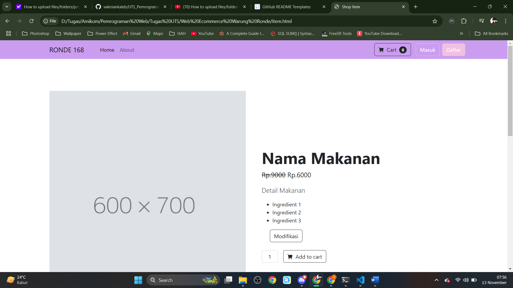
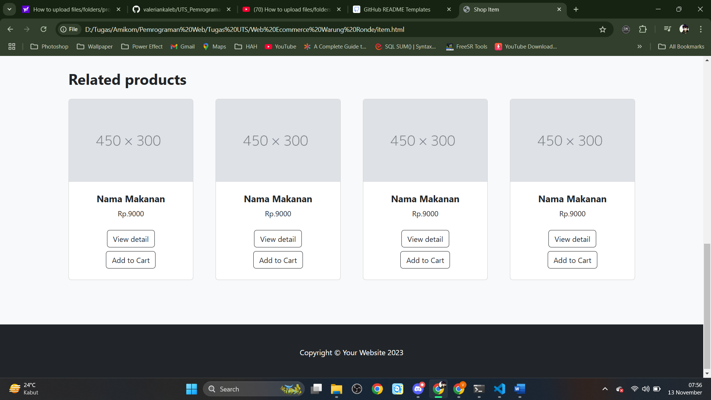

# Tampilan Keranjang
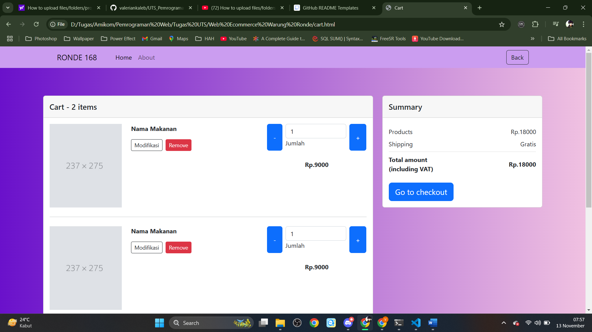
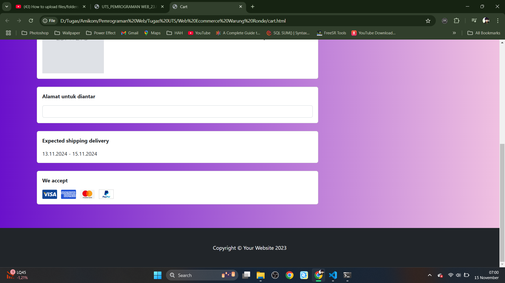

# Tampilan About
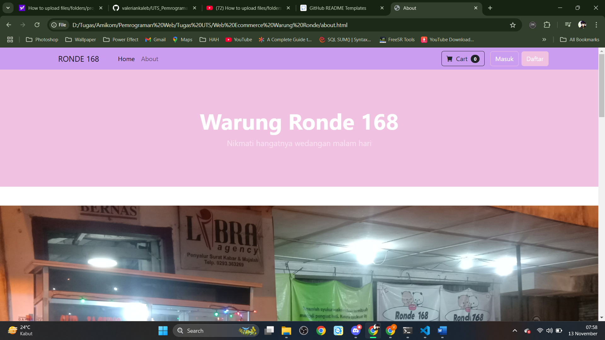
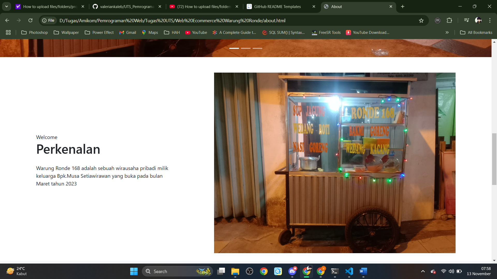
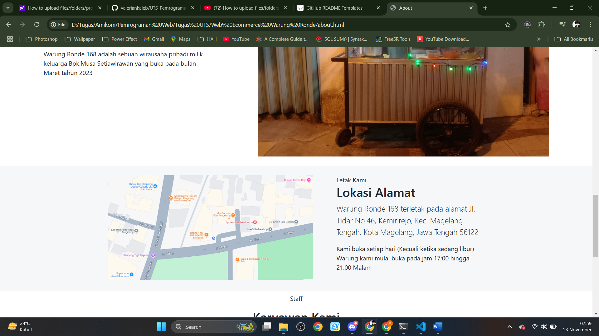
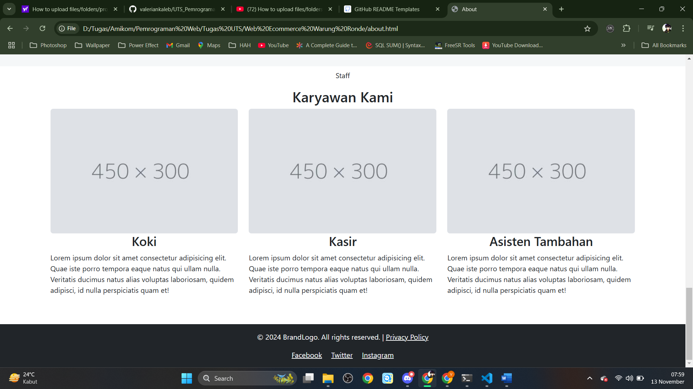

# Tampilan Login
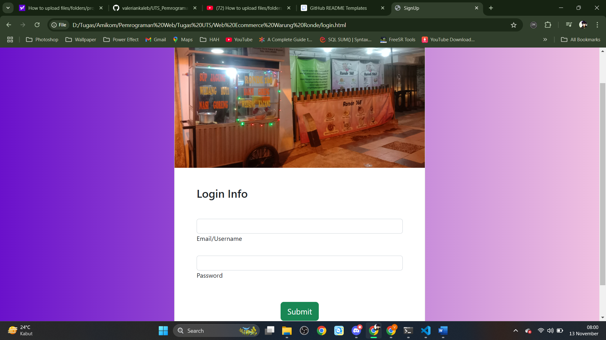

# Tampilan Registrasi
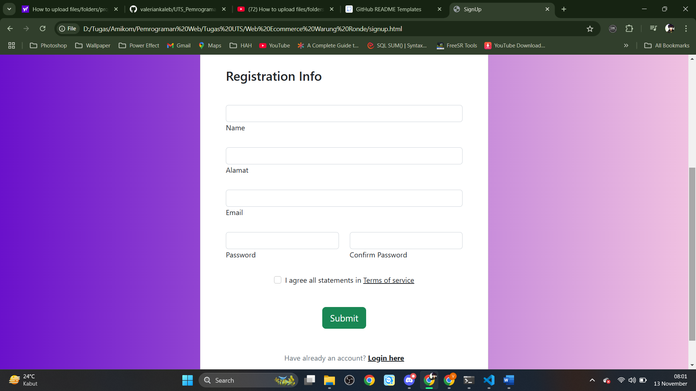